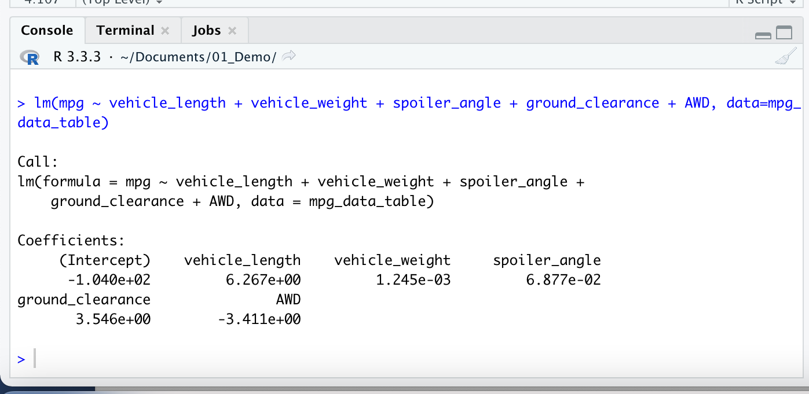

# MechaCar_Statistical_Analysis
## Linear Regression to Predict MPG

## Background
Jeremy is approached by upper management about a special project. AutosRUs’ newest prototype, the MechaCar, is suffering from production troubles that are blocking the manufacturing team’s progress. I was asked to assist Jeremy with this project.

## Written Summary for Deliverable 1
1. The ground clerance vehicle not random amount of variance to the mpg values.
2. The slop is not zero because the P-Value is 5.35e-11. Which is smaller then .05 signaficant level.
3. The model does a good job predicting the mgp because their value is .71.

## Summary Statistics on Suspension Coils
## Deliverable 2

Lot 1 and Lot 2 are within the design percification. But, lot 3 has a lot more variance that exceed that manufacture specs but combin data is within the percification.

## T-Tests on Suspension Coils
## Deliverable 3
According to the T-Test lot 1 and lot 2 PSI value are not satistical different from the population mean. However, the P-Value lot 3 .041 which is below the significant level that mean it is different from the population mean.
